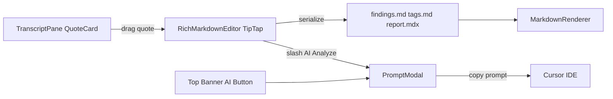

# Editable Markdown + AI Custom Plan

## Goal

Unify the authoring experience so users can edit formatted markdown directly (not just raw), use slash commands (including AI Analyze), and invoke AI workflows with a new `Custom` capsule that supports reusable prompt templates.

## Scope

- Pages: Findings, Tags, Report.
- Editor approach: TipTap-based rich editor with markdown persistence.
- AI modal changes: add `Custom` capsule in Findings/Tags/Report contexts and default behavior based on launch source.

## Architecture Changes

- Introduce a new rich markdown editor component (`TipTap`) and keep current raw editor as fallback during rollout.
- Standardize AI modal action model to include `custom` action and launch-source-aware default selection.
- Add slash-command extension that can open AI modal from inside the editor.

## Implementation Steps

1. **Create rich editor foundation**

- Add `RichMarkdownEditor` (new file), powered by TipTap with:
  - Basic marks/nodes: paragraph, headings, bullet list, ordered list, image, hard break.
  - Markdown import/export bridge.
  - Existing save behavior (`Mod-s`) parity with current editor.
- Keep current `MarkdownEditor` available under a feature toggle/fallback path.
- Target files:
  - [d:/research-repo/src/components/builder/MarkdownEditor.tsx](d:/research-repo/src/components/builder/MarkdownEditor.tsx)
  - [d:/research-repo/src/components/builder/DocumentWorkspace.tsx](d:/research-repo/src/components/builder/DocumentWorkspace.tsx)
  - [d:/research-repo/src/app/builder/[slug]/report/page.tsx](d:/research-repo/src/app/builder/[slug]/report/page.tsx)

1. **Support formatted clip drag-and-drop into rich editor**

- Add a custom `ClipNode` (or quote-block node) in TipTap so transcript drag inserts a formatted quote block (not raw text blob).
- Update `QuoteCard` drag payload to include structured clip JSON (while preserving `text/plain` fallback).
- On serialization, persist to existing markdown quote format so downstream parsing/export remains compatible.
- Target files:
  - [d:/research-repo/src/components/builder/QuoteCard.tsx](d:/research-repo/src/components/builder/QuoteCard.tsx)
  - [d:/research-repo/src/components/builder/ClipCreator.tsx](d:/research-repo/src/components/builder/ClipCreator.tsx)
  - [d:/research-repo/src/lib/quote-parser.ts](d:/research-repo/src/lib/quote-parser.ts)

1. **Add slash command menu in rich editor**

- Implement `/` command palette with entries:
  - Heading 1/2/3
  - Bullet List
  - Numbered List
  - Image
  - AI Analyze
- `AI Analyze` command triggers modal open callback provided by page/container.
- Target files:
  - [d:/research-repo/src/components/builder/DocumentWorkspace.tsx](d:/research-repo/src/components/builder/DocumentWorkspace.tsx)
  - [d:/research-repo/src/app/builder/[slug]/report/page.tsx](d:/research-repo/src/app/builder/[slug]/report/page.tsx)
  - New editor/slash files under `src/components/builder/`.

1. **Expand PromptModal with `Custom` capsule and templates**

- Extend `AIAction` with `custom`.
- Add third capsule across contexts:
  - Findings: `Initial Findings`, `Refine Findings`, `Custom`
  - Tags: `Tag Findings`, `Tag Transcripts`, `Custom`
  - Report: `AI synthesis`, `Custom` (or equivalent 2-card layout if preferred)
- In `Custom`, show template chips/cards that generate editable prompt text (copy-ready), e.g.:
  - Rewrite/restructure report
  - Add participant/session context table
  - Incorporate additional research question
  - Improve clarity/flow
- Keep prompt textarea editable as-is.
- Target files:
  - [d:/research-repo/src/components/builder/PromptModal.tsx](d:/research-repo/src/components/builder/PromptModal.tsx)
  - [d:/research-repo/src/lib/prompts.ts](d:/research-repo/src/lib/prompts.ts)

1. **Default behavior by launch source**

- Add a launch source prop (e.g., `launchSource: "banner" | "slash"`).
- Default rules:
  - Banner AI button -> first capsule for page context.
  - Slash `/` -> `Custom` preselected.
- Wire through both invocations:
  - DocumentWorkspace (Findings/Tags)
  - Report page
- Target files:
  - [d:/research-repo/src/components/builder/DocumentWorkspace.tsx](d:/research-repo/src/components/builder/DocumentWorkspace.tsx)
  - [d:/research-repo/src/app/builder/[slug]/report/page.tsx](d:/research-repo/src/app/builder/[slug]/report/page.tsx)
  - [d:/research-repo/src/components/builder/PromptModal.tsx](d:/research-repo/src/components/builder/PromptModal.tsx)

1. **UX/design-system alignment**

- Apply existing compact modal token patterns (same as AI Analysis modal):
  - Header/footer heights and paddings
  - Button sizes (`py-2`, `text-sm`, no bulky shadows)
  - Input paddings and focus ring consistency
- Ensure New Project / Quote Edit / Codebook modal changes remain consistent while introducing new UI pieces.

1. **Testing and verification**

- Unit tests:
  - PromptModal action switching + default selection by launch source.
  - Slash menu command mapping.
  - Clip DnD insertion into rich editor and markdown serialization.
- Integration checks:
  - Findings/Tags/Report save-refresh parity.
  - Existing export paths still parse quotes.
- Lint/type checks for modified files.

## Rollout / Risk Control

- Stage 1: Introduce rich editor behind component-level fallback toggle.
- Stage 2: Enable for Findings/Tags/Report after parity checks.
- Stage 3: Remove fallback when stable.

## Acceptance Criteria

- Users can type and edit in formatted markdown on Findings/Tags/Report.
- `/` menu offers heading/list/image/AI Analyze commands.
- Dragging transcript clips into formatted editor inserts a formatted quote block and persists correctly.
- AI modal includes `Custom` capsule in each context with reusable templates.
- Slash-launched AI opens on `Custom`; banner-launched AI opens on first default capsule.

